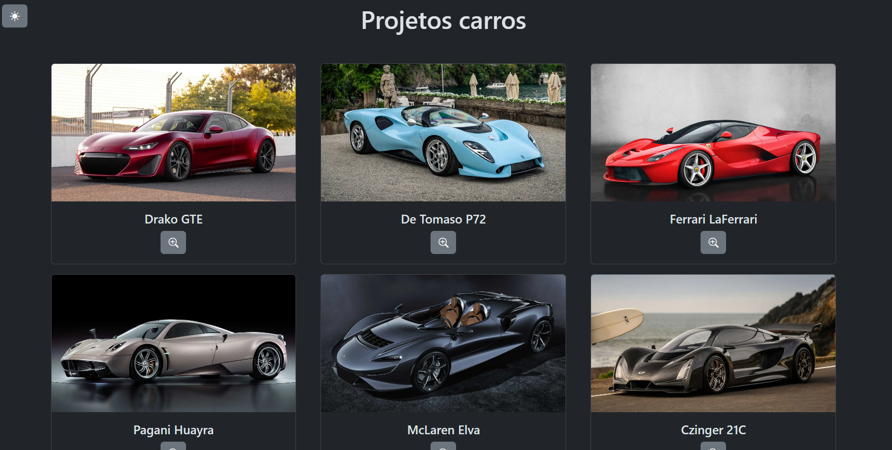
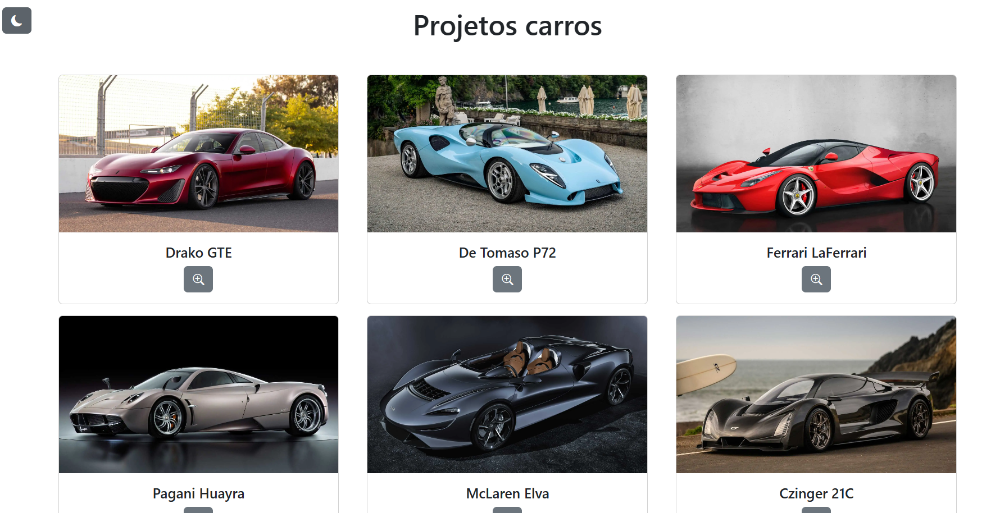
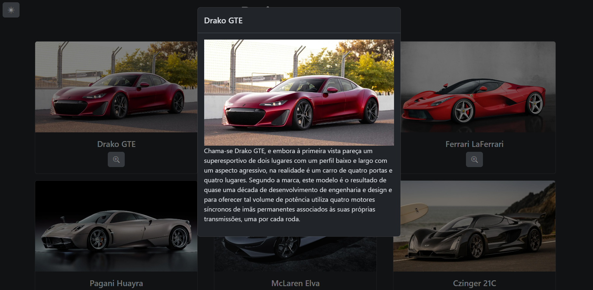

# Bibliote de Carros
Projeto realizado como projeto final do curso de introdução ao JavaScript da estudante.dev, que foi proposto pelo curso #ElasNaTech.

## Criação
Para o projeto foi utilizada a linguagem de marcação HTML e a linguagem de programação JS, com a  framework bootstrap. Nela foi utilizado uma lista de carros aparecendo de forma aleatória, também foi adicionado a proposta para mudança da cor de fundo.

### Tela Inicial

### Tela após escolher o fundo
 

### Quando um carro é selecional
 
